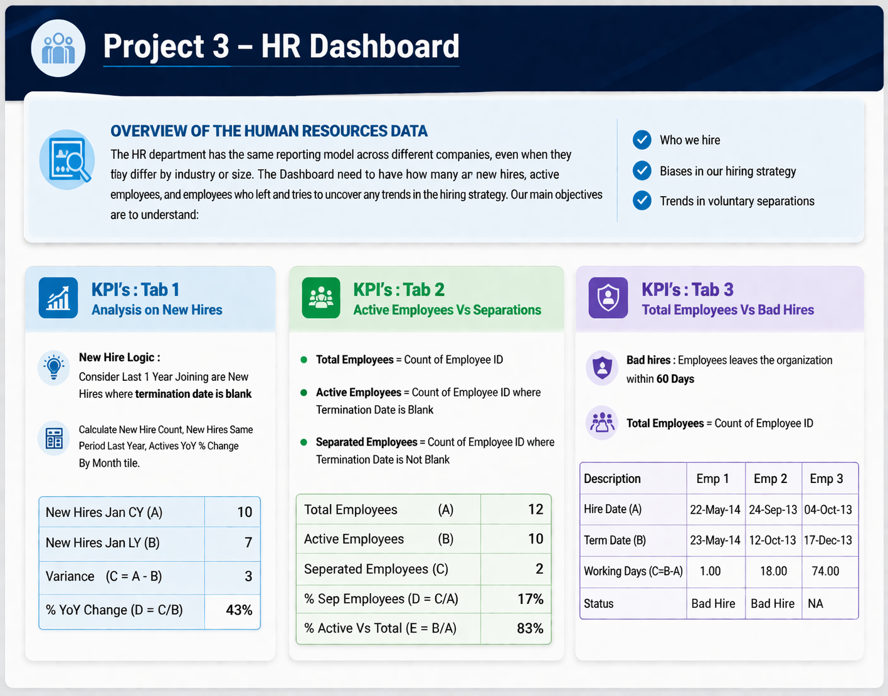
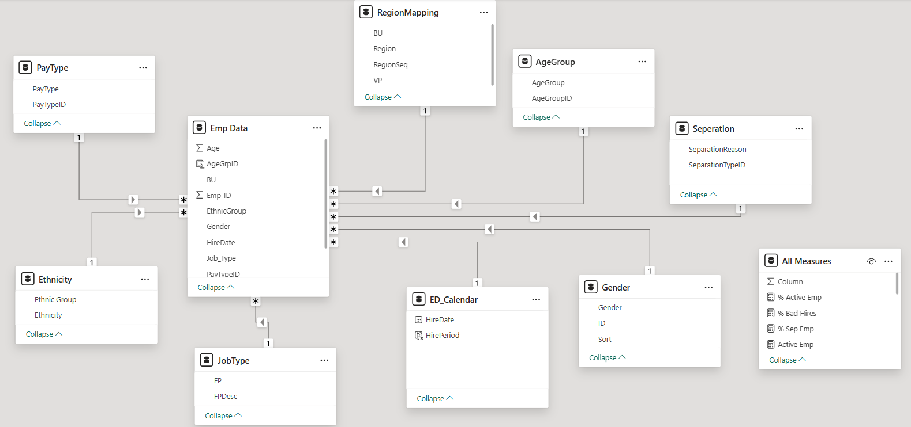
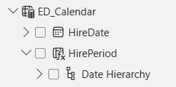

# HR Workforce Analytics Dashboard (Power BI)

## Overview
This project focuses on analyzing HR data to understand hiring trends, employee status, and workforce quality.  
The dashboard provides insights into **new hires, active employees, separations, and bad hires**.

---

## Objectives
- Analyze **hiring trends over time**
- Identify **bad hires** (employees leaving within 60 days)
- Compare **active vs separated employees**
- Understand workforce distribution across **age, region, and job type**

---

## Key Insights
- New hires decreased YoY with noticeable variation across regions and age groups  
- ~75% employees are active while ~25% are separated :contentReference[oaicite:0]{index=0}  
- Bad hires account for ~1.6% of total employees :contentReference[oaicite:1]{index=1}  

---

## Learnings
- Importance of **Hire Period column** to correctly track new hires over time  
- Built logic to define **Bad Hires (terminated within 60 days)**  
- Performed analysis on:
  - Hiring trends
  - Active vs separated employees
  - Workforce distribution  

---

## 🗂️ Data Model
- Star schema with fact table: `Emp Data`
- Dimension tables:
  - Calendar
  - Region Mapping
  - Job Type
  - Gender
  - Ethnicity
  - Age Group

---

## 📸 Dashboard Preview

## Project Overview

## Model View

## Calendar Table

---

## Measures (DAX)
- Total Employees  
- Active Employees  
- Separated Employees  
- New Hires CY / LY  
- Variance & Variance %  
- % Active Employees  
- % Separated Employees  
- Bad Hires  
- % Bad Hires  

---

## Tools Used
- Power BI  
- DAX  
- Data Modeling  

---

## Conclusion
This dashboard helps in understanding hiring efficiency, employee retention, and identifying potential hiring issues to support better HR decisions.
